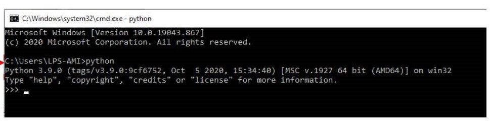
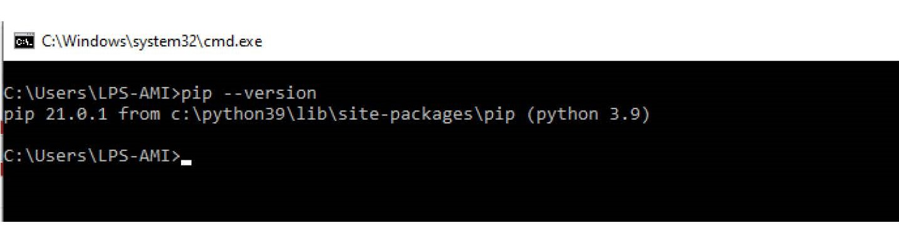
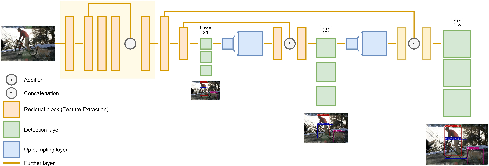

# How to Setup Python and Jupyter Notebook on Windows

Ditulis oleh Muhammad Islah, Fachrur Rozi, Rino Aldi Pratama, Muhammad Ulul Azi, Sofwan Benhawan, Rivan Adi Saputra, Moch Adhyansyah Nugraha, Angga Putra Pradana, Suhendra, Yoga Nur Qhazhan, dan Chandra Himawan.

## How to Setup Python
Tuliskan langkah-langkahnya di sini. (Kelompok I)
1. Download python dari https://www.python.org/downloads/windows/
2. Pilih Python versi 3.7.10 atau 3.8.8
3. Pastikan download yang sesuai dengan windows yang digunakan (32-bit) atau (64-bit).
4. Lakukan Instalasi seperti biasanya.
5. Saat instalasi berjalan pilih customize installation lalu pastikan kotak dialog pada "Add Python 3.8 To PATH" tercentang.
6. Lalu pastikan PIP ikut terinstall, untuk menginstall PIP pastikan kotak dialog pada proses instalasi Python sudah tercentang.
7. Untuk memastikan Pyhon sudah terinstal, ketik "cmd" pada Menu Start/Search box/icon. kemudian ketik perintah "python" pada cmd.
8. jika python sudah terinstal dengan benar maka tidak akan muncul output seperti di gambar.

9. Lalu untuk mengecek PIP sudah terinstal dengan benar, tinggal buka kembali cmd dan ketik perintah "pip --version".
10. jika sudah terinstal dengan benar maka akan muncul seperti di gambar.


--------------------------------------------------------

Contoh menambahkan gambar
 

 

## How to Setup Pytorch
Tuliskan langkah-langkahnya di sini. (Kelompok I)
1. Pastikan PIP sudah terinstall
2. lalu ketik perintah seperti di gambar (sesuaikan dengan PC yang digunakan apakah integrated GPU atau dedicated GPU/GPU NVIDIA)

3. Jika proses instalasi Pytorch di cmd sudah selesai lakukan pengecekan apakah Pytorch sudah terinstal dengan benar atau tidak.
4. ketik "cmd" pada Menu Start/Search box/icon. kemudian ketik perintah "python" pada cmd lalu enter dan ketik perintah "import torch".
5. Jika Pytorch terinstal dengan benar maka tidak akan muncul baris error seperti di gambar.


## How to Setup Jupyter Notebook
Tuliskan langkah-langkahnya di sini. (Kelompok II)
1. Ketik command berikut pada cmd
```
pip install jupyterlab
```
2. 
